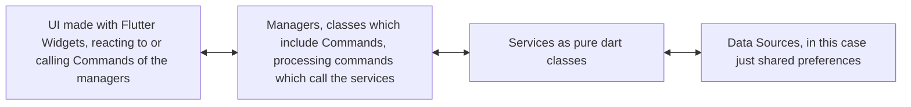

# MediaDojo

A podcast and radio desktop player as an example app to showcase the power of [flutter_it](https://flutter-it.dev)

Disclaimer: the name might change in the future. :blush:

## What is this app about?

MediaDojo is a desktop app for listening to podcasts and radio stations, built with Flutter. It serves as an example application to demonstrate how to use a set of packages (`flutter_it`, `get_it`, `command_it`, `watch_it`, `listen_it`) to build a well-structured Flutter application - without code-generation! :rocket:

The app allows you to:
- Search for new podcasts.
- Subscribe to your favorite podcasts.
- See a list of episodes for each podcast.
- Play and pause podcast episodes.
- Download episodes for offline listening.

It's designed to showcase a clean architecture, separating business logic from the UI, making the app easier to test, maintain, and scale, with very few lines of code and as already mentioned ... without code generation! :tada:

## flutter-it

`flutter-it` is a suite of packages designed to help you build robust, scalable, and maintainable Flutter applications. It promotes a clean architecture by providing tools for:

- **Dependency Injection:** Using [get_it](https://pub.dev/packages/get_it).
- **State Management:** Using [watch_it](https://pub.dev/packages/watch_it).
- **Business Logic Encapsulation:** Using [command_it](https://pub.dev/packages/command_it).
- **Event Handling:** Using [listen_it](https://pub.dev/packages/listen_it).

By using these packages together, you can create a clear separation of concerns in your application, with highly reactive UIs that respond to changes in managers!

You can also just import the package [flutter_it](https://pub.dev/packages/flutter_it) which comes with all 4 packages included, if you need them all.
## get-it

In MediaDojo, `get-it` is used as a service locator to manage dependencies. This means we can register our services in a central place and access them from anywhere in the app without using `InheritedWidget` or passing them down the widget tree.

Example classes registered in MediaDojo:
- `PodcastService`: For fetching podcast data from the internet.
- `PodcastLibraryService`: For managing the list of subscribed podcasts and downloaded episodes.
- `PodcastManager`: For using commands for the search and the loading of the feeds.
- `PlayerManager`: For managing audio playback.
- `DownloadManager`: For handling episode downloads.
- `SettingsManager`: For managing user settings.
- `RadioManager`: For managing radio stations.
- `RadioService`: For fetching radio station data.

This decouples our UI from our services and managers, making them easier to test and access the references.

## Architecture

## command-it

"*command_it is a way to manage your state based on ValueListenable and the Command design pattern. A Command is an object that wraps a function, making it callable while providing reactive state updates—perfect for bridging your UI and business logic.*"  [(see the documentation for more details)](https://flutter-it.dev/documentation/command_it/getting_started)

This has several advantages:
- Flutter Widgets can call commands ***somewhere*** and then react to command results and errors ***somewhere else***. This leads to a very clean separation of concerns and your code shrinks significantly.
- Commands can be wrapped inside Manager Classes, which are registered with `get-it`. This leads to a very clean architecture.

## watch-it

`watch-it` is used for reactive state management. It allows our UI to "watch" for changes in our data models or services and automatically rebuild when a change occurs or register handlers for side effects.
In MediaDojo, we could use `watch-it` to:

- Watch the current playback position and update the progress bar in the UI.
- Watch the list of downloaded episodes and update the download section in the UI.
- Watch the playback state (playing, paused, stopped) and update the play/pause button accordingly.

## listen-it

listen_it gives ValueListenables super powers and provides two essential reactive primitives for Flutter development:

    - Reactive Collections - ListNotifier, MapNotifier, SetNotifier that automatically notify listeners when their contents change
    - ValueListenable Operators - Extension methods that let you transform, filter, combine, and react to value changes

For more details, see the [documentation](https://flutter-it.dev/documentation/listen_it/listen_it).

In MediaDojo, `listen-it` could be used to:

- select a specific value from the PlayerState and react to changes in that value.

## Detailed tutorial

Comming soon! :smile: